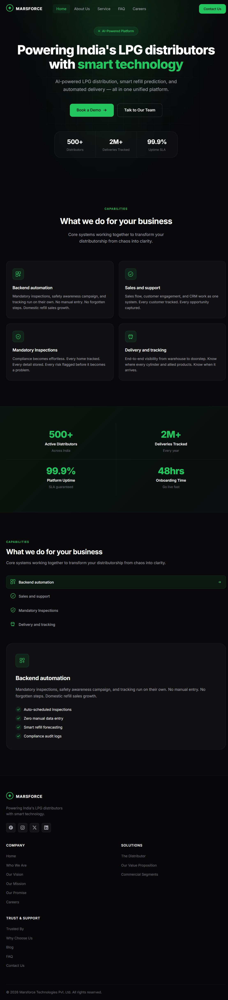

# Marsforce Website

A responsive React.js website for **Marsforce** — an AI-powered LPG distribution platform for India's distributors.

Built as part of a React Developer assessment task based on a provided Figma design.

---

## Live Demo

🔗 [View Live](https://marsforce-website.vercel.app)

---

## Preview



---

## Features

- ✅ Pixel-perfect implementation of Figma design
- ✅ Fully responsive — mobile, tablet, desktop
- ✅ Smooth scroll-triggered card reveal animations (swipe-down effect)
- ✅ Animated number counters on scroll
- ✅ Hero section with fade-up entrance sequence
- ✅ Interactive capabilities tab section
- ✅ Sticky navbar with blur backdrop on scroll
- ✅ Mobile hamburger menu
- ✅ Clean component structure
- ✅ Custom `useInView` hook with IntersectionObserver

---

## Tech Stack

- **React.js** 18
- **CSS3** — custom properties, animations, transitions
- **Create React App**
- **Inter** font (Google Fonts)
- No external UI libraries

---

## Project Structure

```
src/
├── components/
│   ├── Navbar.js         # Sticky navbar with mobile menu
│   ├── Hero.js           # Hero section with animations
│   ├── Features.js       # 4-card feature grid
│   ├── Stats.js          # Animated stats counters
│   ├── Capabilities.js   # Tabbed capabilities section
│   └── Footer.js         # Footer with links and socials
├── hooks/
│   └── useInView.js      # IntersectionObserver hook
├── App.js
├── index.js
└── styles.css            # All styles and animations
```

---

## Getting Started

```bash
# Clone the repo
git clone https://github.com/tony-sde/marsforce-website.git

# Navigate into the project
cd marsforce-website

# Install dependencies
npm install

# Start dev server
npm start
```

App runs at `http://localhost:3000`

---

## Animations Implemented

| Animation | Trigger | Effect |
|-----------|---------|--------|
| Hero content | Page load | Fade up, staggered delay |
| Feature cards | Scroll into view | Swipe down, one by one |
| Stats counters | Scroll into view | Count up with easing |
| Capabilities card | Tab switch | Swipe down reveal |
| Navbar | Scroll | Blur backdrop fade in |
| Buttons | Hover | Lift + glow |

---

## Deployment

Deployed on **Vercel** via GitHub integration.

```bash
npm run build
```

---

## Author

**Yogeshwar** — Full Stack Developer  
[GitHub](https://github.com/yogesh-sde)
